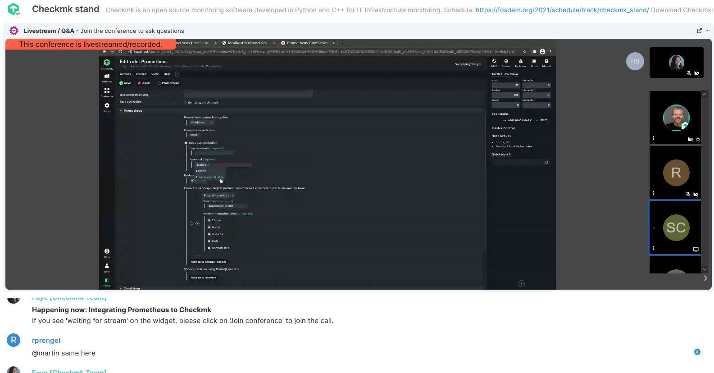

FOSDEM was the last physical event I attended (wow, goosebumps) as it just slipped in right on time before the pandemic started in Europe. For this year’s edition, it was of course, online. I have attended a couple of online events in the past with very positive expectations, only to be disappointed. For some reason, big organizations loved using these big, bloated proprietary online event tools that _really sucked_. Some tried so hard to emulate the physical event vibes, with graphics of event venues and places that look like physical booths and big screens you would see in the lobby (I hated that concept SO much I am wondering how I don’t see anyone talking about how wrong this approach is), some chose a webinar approach and some really put on everyone live.

I’ve seen a couple of approaches to what happens aside from the main track of talks. For us at tribe29 for example, we had Q&A in another room after the talk on the main track and we had multiple tracks of evening social events that still are guided by a topic/theme. I have seen how labor-intensive this can be organizing-wise, that’s why I’m a huge fan of FOSDEM’s practical and lean approach to online events this year. With FOSDEM’s physical format, the event spans a whole campus where you run around buildings. You can imagine how massive it can be, running sessions in multiple places, when done online. But instead of having a full-blown visualization of an event space and many other features to make it feel like a physical event, it just embraced the new normal and built everything on a Matrix server. It’s the lightest online event I’ve ever seen. No heavy loading of random elements and confusing setups to enter the talk you want to attend.

This year, other than a talk at the Network Monitoring Devroom, we get to run a virtual stand at FOSDEM. The team had set up pages under stand.fosdem.org, and we committed our changes to the GitHub repository that we provided to the organizers. Our edits then get pulled to the repo of the stands website.


The virtual stands look like this:



It’s just your usual messenger app format, but with a widget on top that plays the live stream. The same widget also has a ‘Join Conference’ button which allows you to be part of the livestream.

We ran our virtual stand the whole day in FOSDEM and it was almost as exhausting as the physical one! It’s great though that we didn’t have to use up our voice or worry about lunch. From our experience, here are some things I learned to have an effective virtual booth in this format.

## 1. Run scheduled sessions

Create and publish the schedule of activities in your booth, as if you’re hosting a virtual mini event of your own. Take advantage of the fact that you have more control of your time in this format, unlike in physical booths where it’s so easy to be carried away by what the people in front of you are asking. On the flip side, virtual events are at a disadvantage because it’s not so easy to convince people to drop by. You cannot really make those spontaneous encounters happen, where people just happen to walk in your direction and set their eyes on your materials at the booth. With an online format it’s important to have schedules, so people have an expectation of why they should drop by and when.

Your activities can be as simple as an hourly demo or an ask-me-anything session. The demos are what you would normally do during a physical event, only that you don’t have to repeat it for every single person now. The AMAs are simply what people would normally do if they drop by your physical booth and have a random question.

For FOSDEM, standholders can publish their schedule along with the official conference schedule page. Just to be sure, we also published our schedule on our own stand page. Our demos happened every hour, had different themes, and was repeated twice in a day. We also have non-demo activities where we talked about our product and how they can contribute.


## 2. Promote aggressively on social media

If most of the conference goers are active on social or it’s as free as FOSDEM where people can easily become attendees, make sure you have a small plan to promote your booth and your activities there.

You can publish your schedule days before and amplify it by posting about your schedule for the day, what is going on and what’s next. If you can, post about the small details of what’s happening right now in your booth. Don’t forget to tell people how to join, and make it as simple as possible.

## 3. Welcome people personally

Whenever logistically possible (that is, your booth visitors do not come in hordes that overwhelm your channel), try to welcome each person who drops by in your booth. Just like in physical events, you encourage people to engage with you when they briefly stop by looking at your booth, by talking to them about their background, interests etc. and giving them an elevator pitch of what your product is.

It’s great that with the chat format of Matrix, you can see the username of the person who joins your room. It’s easy to mention their username to get their attention and welcome them. Other than welcoming them, it’s also important to tell them what’s going on and what they can do to interact. For us, we have this format, that of course changes depending on the situation and the person. 

``` 
Welcome to the Checkmk stand , (name)! We’re doing a live demo right now. Feel free to type in your questions and requests here in the chat and we’re going to address them in the livestream! You can also click on ‘Join Conference’ to join us live.” 
```

## 4. Keep your chatroom running

When we do physical booths, we just wait until people come in and then we start talking. One could easily assume that virtual booths will run the same, that people will enter the room and declare what they are here for. Not exactly true. In physical booths, they can see people behind the booth, what they are up to, so they can make judgments on how they should interact. Being quiet in a virtual booth means well… being quiet. No one can see anything and get some context on how this booth works. That’s why the previous point is important, as it orients people of what’s going on in this virtual space.

Post about what’s going on and what’s coming next. Repeat them at healthy intervals (e.g. don't post about it every minute or while some people are having a convo on the chat). This quickly tells people that there are actually people at the booth and there’s stuff going on.

## Bonus: Extra preparations for backup conference rooms and 1-on-1 sessions

There’s nothing more terrifying for online event organizers than servers going down. It’s very likely to happen, but don’t fret because it can just be a short hiccup too. We just need to be prepared for that short downtime or complete crashing of the system. For our virtual booth, we have 9 meeting room links from 3 different providers prepared.

We also want to be ready for people who would like to have a 1-on-1 chat with our team during the event, so we have set-up Calendly pages where they can book in advance. We prepared links from 3 different video call providers (Zoom, Whereby and Jitsi) so that we can also have multiple options depending on the participant’s preference. Of course, other than booking in advance, our team members and a conference attendee can easily hop in there when they want.
